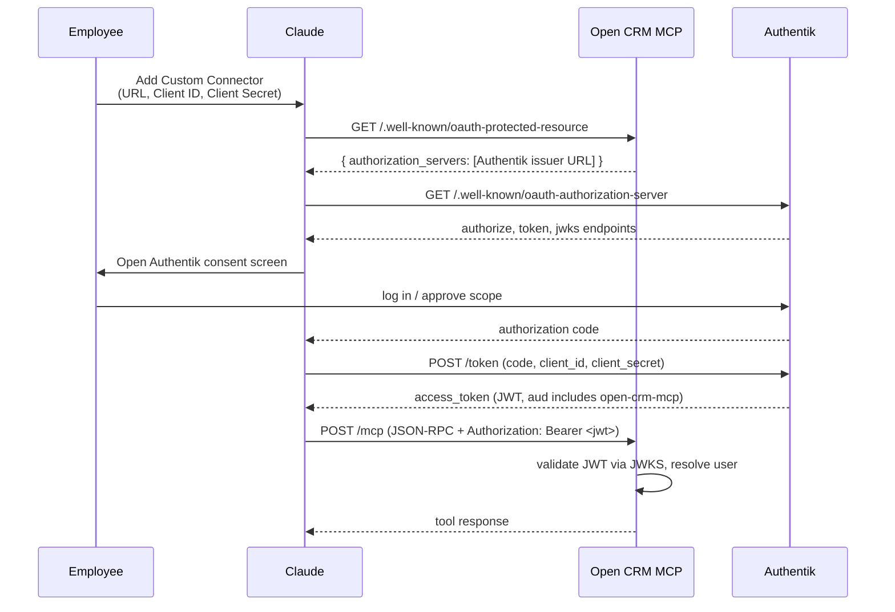
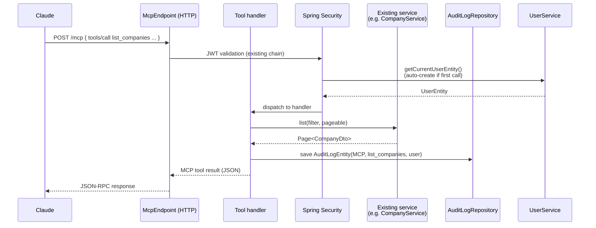
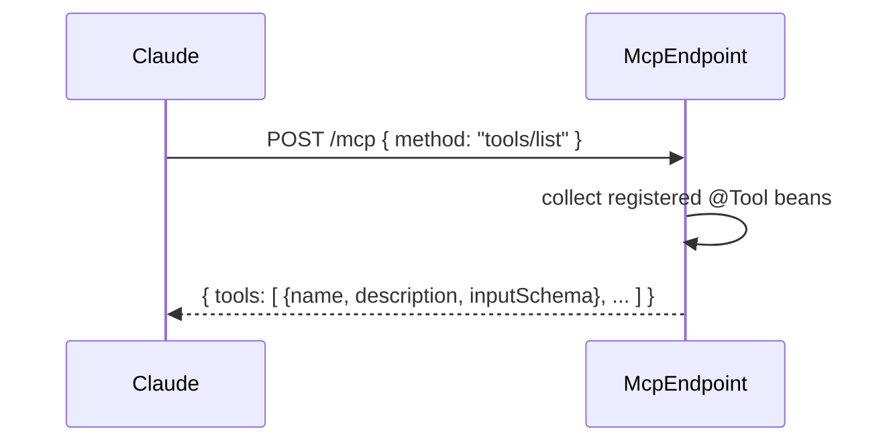

# Design: MCP Connector for Open CRM

## GitHub Issue

— (no issue; spec drives the work)

## Summary

Open CRM exposes a new **Model Context Protocol (MCP) HTTP endpoint** so that Anthropic's Claude can be configured to talk to the CRM as a "Custom Connector". Employees who already log in to Claude via the company's Authentik SSO can then ask Claude to look up companies, contacts, tasks, tags, comments, and run a global search against their CRM — without leaving the chat.

Authentication is delegated to the existing Authentik OIDC infrastructure via a **second, dedicated OAuth client** named `open-crm-mcp`. Each MCP call carries the employee's personal JWT, so the existing role-based access control, audit log, and user-entity model continue to apply naturally. The first release is **read-only**; write tools (create comment, create task, set tag) are an explicit follow-up.

## Goals

- Let employees consume CRM data inside Claude conversations via a properly registered MCP server.
- Reuse the existing Authentik OIDC infrastructure — no new authentication scheme.
- Preserve per-user identity end-to-end: the JWT that arrives at the MCP endpoint is the employee's own, so audit log entries and RBAC decisions remain meaningful.
- Ship a small, well-scoped tool catalog that covers the natural read use cases: list, get, search, comments.
- Keep the implementation strictly additive — no changes to existing REST controllers, services, or security configuration beyond a new endpoint and a new OAuth client registration.

## Non-goals

- **Write operations.** Creating, updating, or deleting CRM entities through Claude is explicitly out of scope for v1. The architecture must allow these to be added later without restructuring auth, audit, or transport.
- **Exposing administrative resources via MCP.** API keys, webhooks, and the audit log itself are not part of the tool catalog.
- **A new authentication scheme.** No new shared "MCP service account", no new password-based auth, no new internal token format. Authentik remains the single source of identity.
- **Strict `aud` validation** on the MCP endpoint. Today the resource server only validates the signature; tightening to enforce `aud=open-crm-mcp` is intentionally deferred (see `TODO.md` § "Strikte Audience-Prüfung für JWT-Validierung").
- **Rate limiting** beyond whatever the existing infrastructure already provides.
- **MCP "Resources"** (`crm://...` URIs). The tool model is sufficient for v1.
- **Internationalization of tool responses.** Tool names and descriptions are English; response payloads carry data as stored.
- **A dedicated frontend UI.** No CRM page is added; the connector is configured inside Claude.

## Pre-production checklist (GDPR / DSGVO)

Sending personal CRM data (names, e-mail addresses, postal addresses, phone numbers, birthdays, free-text comments) to Anthropic makes Anthropic a processor under Art. 28 GDPR. The technical work in this spec produces a feature that **must not be enabled in production until** the following organizational steps are complete. Each item is the responsibility of the legal / data-protection track, not of this spec.

1. **Data Processing Addendum (DPA) signed with Anthropic.** Anthropic publishes a standard DPA; Claude Enterprise customers usually sign it as part of onboarding.
2. **Zero Data Retention confirmed in writing.** The Anthropic plan in use must guarantee that conversation data (and therefore CRM data flowing through MCP) is not retained for training or for general retention beyond the request lifecycle.
3. **Legal basis documented.** Typically Art. 6 (1) lit. f GDPR ("legitimate interest" — internal CRM use) with a documented balancing test; for prospect / customer data also lit. b ("contract performance / preparation").
4. **Data Protection Impact Assessment (DPIA / DSFA) performed.** Required for systematic automated processing of personal data by a third-country processor (USA). The DPIA must reference Anthropic's EU-US Data Privacy Framework certification as the transfer mechanism, or alternatively Standard Contractual Clauses.
5. **Privacy notice updated.** Both the public-facing privacy policy and the internal employee notice must mention that CRM data may be transmitted to Anthropic (USA) on request.
6. **Works council agreement (if applicable).** Employees authenticate with their personal account and the audit log records every MCP call. This is monitoring of employee activity in the same sense as the existing "Updates view" GDPR todo and may require a `Betriebsvereinbarung`.

In addition, the technical design follows **data minimization**:

- The reduced Users tool only returns `id` and `displayName`, never e-mail or avatar.
- Pagination caps at 50 records per call.
- Administrative entities (API keys, webhooks, audit log) are never exposed.

This checklist is reproduced in `behaviors.md` as a "production readiness" check.

## Technical approach

### Building blocks

- **MCP server runtime:** the official Java MCP SDK, integrated via the dedicated Spring WebMVC starter `io.modelcontextprotocol:sdk-spring-webmvc` (Maven coordinates exact name is verified during implementation). The SDK provides:
  - Tool registration via annotated beans.
  - Built-in support for the **Streamable HTTP** transport (the current MCP spec, what Claude speaks).
  - JSON-RPC framing, schema generation from Java types, and error mapping.
- **Authentication:** the existing Spring Security `oauth2-resource-server` configuration. The MCP endpoint is mounted under `/mcp/**` and is included in the existing security chain — JWTs issued by Authentik are validated by the same JWKS as `/api/**`. No new filter, no new principal type.
- **Authorization:** the existing role mapping (`roles` claim → `ROLE_*` authorities). Tool methods that need a specific role use `@PreAuthorize`. For v1, all read tools are open to any authenticated user (matches the existing read-policy on `/api/**`).
- **User entity:** the existing `UserService` is invoked on every tool call to resolve the JWT's `sub` to a `UserEntity`, auto-creating it on first use (same path as the frontend login in spec 065).
- **Audit logging:** every tool call produces one `AuditLogEntity` with `entityType = "MCP"`, `action = INSERT`, `name = <tool-name>`, `user = <current user>`. This is performed in a single `McpAuditInterceptor`-style component invoked from the tool handler.
- **Read backend:** existing services (`CompanyService`, `ContactService`, `TaskService`, `TagService`, `CommentService`, `SearchService`, `UserService`) are reused as-is. The MCP layer is a thin adapter — it does not duplicate filtering or query logic.

### OAuth integration with Authentik



Key points:

- The MCP server **does not implement an authorization server.** It only advertises **Protected Resource Metadata** (`/.well-known/oauth-protected-resource`, RFC 9728) and points at Authentik as the authoritative authorization server. All actual OAuth endpoints live in Authentik.
- The OAuth client `open-crm-mcp` is created **once, manually**, in Authentik before the connector is rolled out. Its Client ID and Client Secret are then pasted into Claude's "Add Custom Connector" dialog. No Dynamic Client Registration is needed in v1.
- The same JWKS endpoint already configured for `/api/**` validates JWTs on `/mcp/**`. Strict `aud` validation is deferred (see TODO).

### Tool call flow



## API design

### MCP endpoint

| Method | Path | Purpose |
|--------|------|---------|
| `GET`  | `/.well-known/oauth-protected-resource` | Advertises Authentik as the authorization server for `/mcp/**` |
| `POST` | `/mcp`              | Streamable HTTP transport endpoint (JSON-RPC 2.0). Tool discovery (`tools/list`) and tool invocation (`tools/call`) both flow through here. |
| `GET`  | `/mcp`              | Streamable HTTP "long-poll" channel for server → client messages. |

Both `/mcp` methods require a Bearer JWT. The OpenAPI security scheme `bearer` (already registered in `OpenApiConfig`) covers them. The protected-resource-metadata endpoint is open (it must be reachable without auth, per RFC 9728).

### Tool catalog (v1)

All tools are read-only. All accept a `page` (default `0`) and `size` (default `20`, max `50`) parameter where they return collections. All tool responses are JSON objects matching the underlying REST DTO shape, with administrative-only fields removed where applicable.

| Tool name | Parameters | Returns | Backing service |
|-----------|------------|---------|-----------------|
| `search` | `q: string`, `limit?: int (max 50)` | `GlobalSearchResultDto` (companies, contacts, tags, comments groups with `id`, `label`, `snippet`, `score`, `ownerType`, `ownerId`) | `SearchService.search()` |
| `list_companies` | `name?: string`, `brevo?: bool`, `tagIds?: UUID[]`, `page?: int`, `size?: int` | `Page<CompanyDto>` (with finance fields) | `CompanyService.list()` |
| `get_company` | `id: UUID` | `CompanyDto` | `CompanyService.findById()` |
| `list_contacts` | `search?: string`, `companyId?: UUID`, `language?: string`, `brevo?: bool`, `tagIds?: UUID[]`, `page?`, `size?` | `Page<ContactDto>` | `ContactService.list()` |
| `get_contact` | `id: UUID` | `ContactDto` | `ContactService.findById()` |
| `list_tasks` | `status?: TaskStatus`, `companyId?: UUID`, `contactId?: UUID`, `tagIds?: UUID[]`, `page?`, `size?` | `Page<TaskDto>` | `TaskService.list()` |
| `get_task` | `id: UUID` | `TaskDto` | `TaskService.findById()` |
| `list_tags` | `page?`, `size?` | `Page<TagDto>` (without counts to keep payload small) | `TagService.list()` |
| `get_tag` | `id: UUID` | `TagDto` | `TagService.findById()` |
| `list_company_comments` | `companyId: UUID` | `List<CommentDto>` (capped at 50) | `CompanyService.listComments()` |
| `list_contact_comments` | `contactId: UUID` | `List<CommentDto>` (capped at 50) | `ContactService.listComments()` |
| `list_task_comments` | `taskId: UUID` | `List<CommentDto>` (capped at 50) | `TaskService.listComments()` |
| `list_users` | `page?`, `size?` | `Page<{ id: UUID, displayName: string }>` — **reduced view**, no e-mail, no avatar | `UserService.list()` with a dedicated projection |

Naming convention: snake_case for tool names (MCP idiom), camelCase for parameters (matches existing DTO field names). All tools are namespaced under the MCP server name "Open CRM" — Claude shows them in its tool picker as e.g. `open-crm.list_companies`.

### What is *not* exposed

- **API keys** (`/api/api-keys`) — administrative configuration data.
- **Webhooks** (`/api/webhooks`) — administrative configuration data.
- **Audit log** (`/api/audit-logs`) — employee monitoring data; needs separate organizational treatment.
- **User e-mail and avatar** — kept inside the existing IT-ADMIN-only frontend view (spec 089). The MCP `list_users` returns the reduced view.
- **Newsletter status fields on contacts** are part of `ContactDto` and therefore included; this is consented marketing-consent data and the GDPR pre-production checklist covers it.

## Data model

No schema changes. The spec is purely additive:

- No new entities, no new tables, no Flyway migration.
- Audit log entries use the existing `audit_log` table with `entity_type = "MCP"`.
- Users are looked up / created via the existing `UserService.getCurrentUserEntity()` path.

## Configuration

A new `@ConfigurationProperties` block `openelements.mcp` is introduced under `application.yml`:

```yaml
openelements:
  mcp:
    enabled: true                 # master switch
    server-name: "Open CRM"       # advertised name in tools/list
    server-version: "0.1.0"       # MCP server version
    max-page-size: 50             # hard cap for paginated tools
    default-page-size: 20
    authorization-server-issuer:  # used to populate protected-resource-metadata
      ${spring.security.oauth2.resourceserver.jwt.issuer-uri:}
```

`enabled: false` removes all MCP endpoints from the routing table and skips bean registration. This lets ops disable the connector instantly if the GDPR checklist is not yet satisfied in a given environment.

## Dependencies

### New Maven dependencies

- `io.modelcontextprotocol:sdk-spring-webmvc` — the official Java MCP SDK with Spring WebMVC integration. Exact artifact coordinate is verified during implementation; if the artifact name differs (e.g. `mcp-server-spring-webmvc`), the same dependency from the same Group ID is used. Streamable HTTP transport ships with the SDK.

### Existing dependencies reused

- `spring-boot-starter-oauth2-resource-server` — JWT validation.
- `spring-services:0.17.0` — base services for audit, users, RBAC.
- `springdoc-openapi-starter-webmvc-ui` — for the protected-resource-metadata endpoint to appear in Swagger UI (optional).

### Authentik configuration (one-time, manual)

A new OAuth2 / OpenID provider and application must be created in Authentik:

- **Name / slug:** `open-crm-mcp`
- **Client type:** Confidential
- **Authorization flow:** company default
- **Redirect URIs:** the redirect URI(s) advertised by Claude's MCP OAuth client. (Anthropic publishes this; the exact value is filled in during rollout.)
- **Scopes:** `openid`, `profile`, `email` — `offline_access` is **not** requested because Claude refreshes tokens via its own session, and Open CRM does not need a refresh-token grant of its own.
- **Roles claim:** the same custom `roles` claim that the existing `open-crm` client emits, so that RBAC mapping (`ROLE_*`) just works.

The resulting Client ID and Client Secret are documented in the deployment runbook and pasted into Claude's "Add Custom Connector" dialog when an operator installs the connector. README is updated with a new "MCP Connector for Claude" section that mirrors the existing "Configure Authentik for Production" section.

## Security considerations

- **Authentication:** identical to the rest of `/api/**` — JWT signature validated via Authentik JWKS, no shared secret on the wire.
- **Authorization:** v1 tools require any authenticated user. The `@PreAuthorize` hooks remain available for future tools that need a specific role.
- **Audit:** every tool invocation produces an audit log row. The action is always `INSERT` (a read is logged as an access event), the `entityType` is `MCP`, the `name` is the tool name, and the user is the JWT subject's resolved user entity.
- **Data minimization:** tools never return administrative entities. The reduced Users projection is enforced server-side; the full `UserDto` shape is never serialized over MCP.
- **Token leakage:** the MCP server validates JWT signature only; a Bearer JWT issued for the `open-crm` web client would technically be accepted today. Strict audience enforcement is deferred (see `TODO.md`). The risk is small because both clients live in the same Authentik tenant and serve the same employee population.
- **Logging:** request payloads and tool arguments must **not** be logged at INFO level. Free-text search queries and entity IDs can be sensitive. INFO-level logs include only `tool=<name> user=<id>`; debug-level logs may include arguments behind an explicit flag.

## Key flows

### Tool discovery



Claude calls this once per session and uses the returned descriptions to decide when to invoke each tool. Tool **descriptions** are therefore part of the user-facing contract — they must be clear and short, e.g.:

> `list_contacts` — "List contacts. Supports search by name/email/company name and filtering by company, language, Brevo origin, and tags. Returns a paginated list (max 50 per call)."

### Audit-log entry per tool call

After a successful (or failed) tool dispatch, an audit log entry is recorded. Failures are logged with `name = "<tool>: <error class>"` so that operators can see misuse patterns later.

### First-time MCP call (auto-provisioning)

When a JWT arrives whose `sub` does not yet correspond to a `UserEntity`, `UserService.getCurrentUserEntity()` creates one — exactly as it does on first frontend login (spec 065). The MCP layer does nothing special.

## Open questions

- **Tool descriptions in German vs English.** All MCP tooling speaks English by convention, but Open CRM's primary audience may be German-speaking. v1 ships English descriptions and English tool names; if usage shows that Claude better matches German prompts to German tool descriptions, this can change later without breaking compatibility.
- **MCP SDK release line.** The official Java MCP SDK is young. If the chosen version still has breaking changes between minor releases, we pin a specific version and update with care.
- **Anthropic's published redirect URI for Claude MCP connectors.** The exact URL must be looked up at implementation time and registered in Authentik. If Anthropic ever rotates it, the Authentik client must be updated.

## Rationale for key choices

- **Why per-user OIDC instead of an API key or shared service account?** RBAC and audit log only have meaning when the request carries the employee's own identity. A shared service account would collapse every Claude action into one CRM user, breaking both.
- **Why a second OAuth client (`open-crm-mcp`) instead of reusing `open-crm`?** Separation of concerns: the web frontend client and the MCP client may evolve independently (different redirect URIs, different consent screens, different scopes once write tools land). Cost is one extra entry in Authentik.
- **Why no Dynamic Client Registration?** Authentik does not support DCR cleanly today, and one manual client creation per environment is a fixed cost paid by ops, not by every employee.
- **Why the official Java MCP SDK and not Spring AI's MCP starter?** The official SDK is the same code, distributed without pulling in the rest of the Spring AI ecosystem. Open CRM has no other Spring AI features and adding the umbrella starter just to register a few tools is unnecessary weight.
- **Why page-based pagination instead of cursor-based?** All existing services return `Page<T>`. Recycling that shape costs nothing and saves writing a new query layer. Drift between web pagination and MCP pagination is the trade-off — acceptable for v1.
- **Why log a `MCP`-typed audit entry for reads?** The existing audit log already records reads of sensitive areas; a Claude read is a transmission to a third country and is at least as sensitive as a frontend read.
- **Why a reduced `list_users` projection instead of inheriting the IT-ADMIN gate from `/api/users`?** A double policy ("IT-ADMIN over HTTP, everyone over MCP") would be confusing; instead, MCP gets a less-revealing view that is genuinely safe for all roles.
