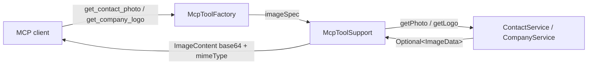

# Design: MCP image tools (contact photo & company logo)

## GitHub Issue

— (no issue yet; spec drives the work)

## Summary

The MCP connector (spec 108) currently exposes contact photos and company logos
only as boolean flags (`hasPhoto` on `ContactDto`, `hasLogo` on `CompanyDto`) —
the actual image bytes are never returned. Every existing MCP tool serializes its
payload to a single JSON **text** result, so there is no path to hand a binary
image to an MCP client.

This spec adds two read-only MCP tools — **`get_contact_photo`** and
**`get_company_logo`** — that return the stored image as a proper MCP
**`ImageContent`** (Base64-encoded bytes plus MIME type), the protocol's native
way to deliver images. To support this, the domain-agnostic MCP runtime
(`McpToolSupport`) gains a second result path that builds an image result while
reusing the existing actor resolution, access logging, and error mapping.

The images are returned **at their stored size** (no downscaling). A request for
an entity that exists but has no image, or for an unknown entity, returns a
not-found tool error (`isError=true`).

## Goals

- Let MCP clients fetch a contact's photo and a company's logo as real images.
- Reuse the existing services (`ContactService.getPhoto`, `CompanyService.getLogo`)
  and the existing MCP auth/logging/error infrastructure unchanged in spirit.
- Keep the image-result mechanism in the reusable base layer
  (`com.openelements.spring.base.mcp`) so other applications and future tools can
  return images too.

## Non-goals

- **Write operations** (uploading/replacing/deleting images via MCP). The
  connector stays read-only.
- **Image resizing / thumbnails.** Images are returned 1:1 as stored. A bounded
  variant can be added later (see *Open questions*).
- **Embedding image bytes into list/get payloads.** `list_contacts`,
  `get_contact`, `list_companies`, `get_company` keep returning only the
  `hasPhoto` / `hasLogo` flags; the image is fetched explicitly by ID.
- **New auth, capabilities, or transport changes.** The tools register through the
  same `McpToolProvider` path and the existing `tools(true)` capability.
- **MCP Resources** (`crm://…` URIs) for images.

## Technical approach

### Current state

`McpToolSupport.spec(tool, logic)` wraps an `McpToolLogic` (returns an arbitrary
`Object`) into a `SyncToolSpecification`. On success it serializes the payload to
JSON and returns `new McpSchema.CallToolResult(json(payload), false)`; on failure
it maps exceptions to error results. Every tool flows through this single
text-producing path.

The data is already available:

- `ContactService.getPhoto(UUID)` → `Optional<ImageData>` (throws
  `ResponseStatusException` 404 when the contact itself does not exist; empty
  `Optional` when the contact exists but has no photo). Contact photos are always
  stored transcoded to JPEG, so `contentType()` is `image/jpeg`.
- `CompanyService.getLogo(UUID)` → `Optional<ImageData>` (same not-found / empty
  semantics). Logos are stored **as uploaded** (not transcoded), so
  `contentType()` reflects the original type (`image/png`, `image/jpeg`, …).
- `ImageData` exposes `byte[] data()` and `String contentType()`.

### Change 1 — image result path in `McpToolSupport` (base layer)

Add an image-producing counterpart to `spec`, sharing the existing actor
resolution, success logging, and exception→error mapping. Concretely:

1. Add a functional interface `McpImageLogic` that returns an `ImageData`:

   ```java
   @FunctionalInterface
   public interface McpImageLogic {
       ImageData run(Map<String, Object> args) throws Exception;
   }
   ```

2. Refactor the private `invoke(...)` so the success branch is parameterized by a
   result-builder, keeping the four `catch` arms (invalid-argument, not-found,
   unavailable, internal) identical for both text and image tools. The text path
   builds `CallToolResult(json(payload), false)`; the image path builds an
   `ImageContent` result.

3. Add the public factory and the image-result helper:

   ```java
   public SyncToolSpecification imageSpec(final McpSchema.Tool tool, final McpImageLogic logic) {
       return new SyncToolSpecification(tool, (exchange, args) ->
           invokeImage(tool.name(), logic, args, McpActorLabel.from(exchange.transportContext())));
   }

   private McpSchema.CallToolResult imageResult(final ImageData image) {
       final String base64 = Base64.getEncoder().encodeToString(image.data());
       final McpSchema.ImageContent content =
           new McpSchema.ImageContent(null, base64, image.contentType());
       return new McpSchema.CallToolResult(List.of(content), false);
   }
   ```

   `McpSchema.ImageContent(Annotations, String data, String mimeType)` and
   `CallToolResult(List<Content>, Boolean isError)` are part of the pinned MCP SDK
   (0.18.3).

The base `mcp` package may depend on `ImageData` — both live in the reusable
spring-services base namespace, so the layer stays domain-agnostic (no CRM
knowledge) while gaining a generic "return an image" capability.

**Rationale.** A dedicated `imageSpec` mirrors the existing one-factory-method-per
-content-type style and keeps the loosely typed `Object` text path untouched.
The alternative — letting `McpToolLogic` return a sentinel image wrapper and
sniffing its type inside `json()` — entangles the text and image paths and is
harder to read; rejected.

### Change 2 — two CRM tools in `McpToolFactory`

Register both tools in `toolSpecifications()` using `support.imageSpec`. Each
distinguishes "entity not found" from "entity has no image" so the messages are
actionable; both surface as not-found tool errors:

```java
private SyncToolSpecification getContactPhotoTool() {
    final Map<String, Object> props = new LinkedHashMap<>();
    props.put("id", uuidProp("The contact ID."));
    final McpSchema.Tool tool = tool("get_contact_photo",
        "Return the contact's photo as an image. Errors if the contact does not exist or has no photo.",
        props, List.of("id"));
    return support.imageSpec(tool, args -> {
        final UUID id = requiredUuid(args, "id");
        final Optional<ImageData> photo;
        try {
            photo = contactService.getPhoto(id);
        } catch (final ResponseStatusException e) {           // 404: contact missing
            throw new NoSuchElementException("Contact not found: " + id);
        }
        return photo.orElseThrow(() -> new NoSuchElementException("Contact has no photo: " + id));
    });
}
```

`get_company_logo` is identical against `companyService.getLogo(id)` with
company-worded messages.

### Tool catalog after this spec

The Phase 1 catalog grows from 9 to 11 tools; the two new entries are appended to
`toolSpecifications()`.



## Key flows

### Happy path — fetch a contact photo

1. Client calls `get_contact_photo` with `{ "id": "<uuid>" }`.
2. `imageSpec` resolves the actor label from the transport context.
3. Tool logic calls `contactService.getPhoto(id)` → non-empty `Optional<ImageData>`.
4. `imageResult` Base64-encodes `data()` and wraps it with `contentType()`
   (`image/jpeg`) as `ImageContent`.
5. One access log line is emitted (`tool=get_contact_photo actor=…`, no arguments).
6. Client receives `CallToolResult(content=[ImageContent], isError=false)`.

### Not-found / no-image

- Unknown contact ID → `ResponseStatusException` 404 → mapped to
  `NoSuchElementException("Contact not found: <id>")` → not-found tool error.
- Contact exists, no photo → empty `Optional` →
  `NoSuchElementException("Contact has no photo: <id>")` → not-found tool error.
- Invalid/missing `id` → `IllegalArgumentException` from `requiredUuid` →
  invalid-argument tool error.

(Identical for `get_company_logo` / `companyService.getLogo`.)

## Dependencies

- Official Java MCP SDK `0.18.3` (already present) — `McpSchema.ImageContent`,
  `McpSchema.CallToolResult`.
- `com.openelements.spring.base.data.image.ImageData` (spring-services `1.2.0`,
  already present).
- Existing `ContactService.getPhoto` / `CompanyService.getLogo` — no change.

## Security considerations

- **Auth:** Both tools register through the existing `/mcp` security chain
  (Phase 1 `X-API-Key`); no new auth surface.
- **Access logging:** Each call emits one structured INFO line (`tool=… actor=…`),
  never the arguments — consistent with all other MCP reads. As with existing
  reads, **no `audit_log` row** is written.
- **Payload size / memory:** Images are returned at stored size. A contact photo
  is JPEG, capped at 20 MB raw on upload; Base64 inflates ~33% (~27 MB worst
  case) and is held in memory for the call. Logos are typically small. This is
  accepted for a low-frequency, per-ID image fetch; no page-size cap applies (the
  result is a single image, not a list). If large payloads become a problem, a
  bounded variant via `ImageData.asJpeg(maxW, maxH)` is the mitigation (see
  *Open questions*).
- **No new data exposure:** The same bytes are already served to authenticated
  users via the REST endpoints `GET /contacts/{id}/photo` and
  `GET /companies/{id}/logo`. MCP exposes them to the authenticated MCP actor only.

## GDPR / DSGVO

- A **contact photo is personal data** (an image of a natural person). This spec
  introduces **no new processing purpose** and **no new storage** — it only
  delivers, over MCP, the photo already collected and already exposed via the web
  UI / REST API to authenticated users. The legal basis, retention, and erasure
  paths are unchanged (deleting the photo or the contact removes it from MCP
  results too, since the tool reads live data).
- **Company logos** are organizational branding and normally not personal data.
- **Data minimization:** images are fetched **only on explicit request by ID**,
  never bundled into list/get responses. Access is attributable via the actor
  label in the access log.

## Open questions

- **Bounded/thumbnail variant.** Should a future increment add an optional
  `maxSize` argument (or a separate thumbnail tool) using
  `ImageData.asJpeg(maxW, maxH)` to cap payloads for clients that only need a
  small preview? Deferred; capture in `docs/TODO.md` if desired.
